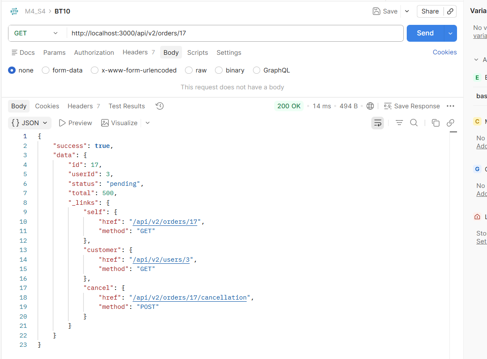
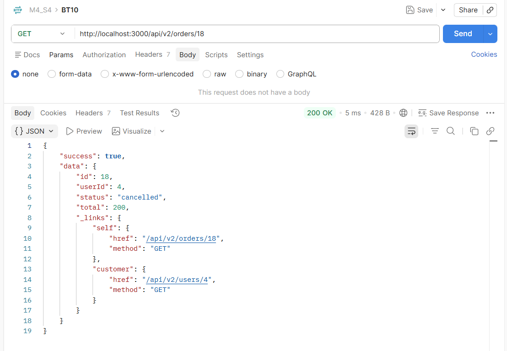

Báo cáo: Thêm links vào response (HATEOAS)

1. Giải thích Richardson Maturity Model (Level 2 vs Level 3)
- Level 2: API đã sử dụng đúng các HTTP Methods và Status Codes chuẩn, nhưng Client vẫn phải tự hardcode hoặc tự tính toán các đường dẫn URL tiếp theo.
- Level 3 (HATEOAS): API đạt tính tự mô tả bằng cách trả kèm khối _links. Server trực tiếp hướng dẫn Client các hành động tiếp theo có thể thực hiện dựa trên trạng thái hiện tại. Client không cần viết logic "if pending thì hiện nút Hủy", mà chỉ cần kiểm tra xem Server có trả về link cancel hay không.

2. Kết quả kiểm thử
Kịch bản 1: Đơn hàng trạng thái pending
- API: GET http://localhost:3000/api/v2/orders/17
- Có trả về link cancel.

Kịch bản 2: Đơn hàng trạng thái cancelled
- API: GET http://localhost:3000/api/v2/orders/18
- Không trả về link cancel.
