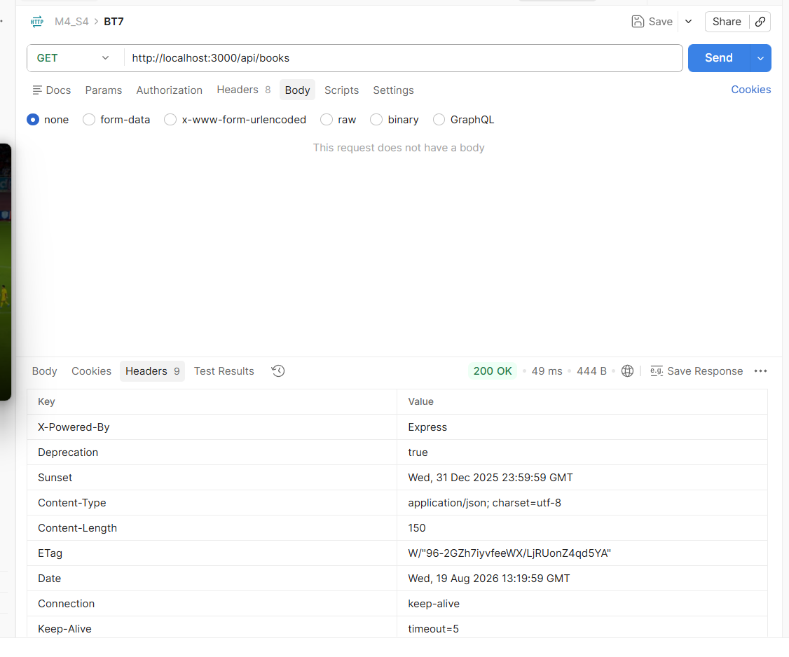

Báo cáo: Bài tập Header Versioning và Deprecation

Kịch bản 1: Request Version 1 (v1)

- Cấu hình Postman:
  - Method: GET /api/books
  - Headers: Api-Version = v1 (hoặc không truyền để lấy mặc định)
- Kết quả mong đợi: Status 200. Data trả về tác giả là chuỗi text: author: "Robert C. Martin".
- Trạng thái Header: 

Kịch bản 2: Request Version 2 (v2)

- Cấu hình Postman:
  - Method: GET /api/books
  - Headers: Api-Version = v2
- Kết quả mong đợi: Status 200. Data trả về tác giả là object: author: { id: 101, name: "Robert C. Martin" } và có thêm field publishedYear. Không bị kèm theo Header Deprecation.

Kịch bản 3: Request Version không hợp lệ (v9)

- Cấu hình Postman:
  - Method: GET /api/books
  - Headers: Api-Version = v9
- Kết quả mong đợi: Trả về HTTP Status 400.
- Dữ liệu trả về: { success: false, code: "UNSUPPORTED_API_VERSION", message: "Hệ thống không hỗ trợ version: v9" }
